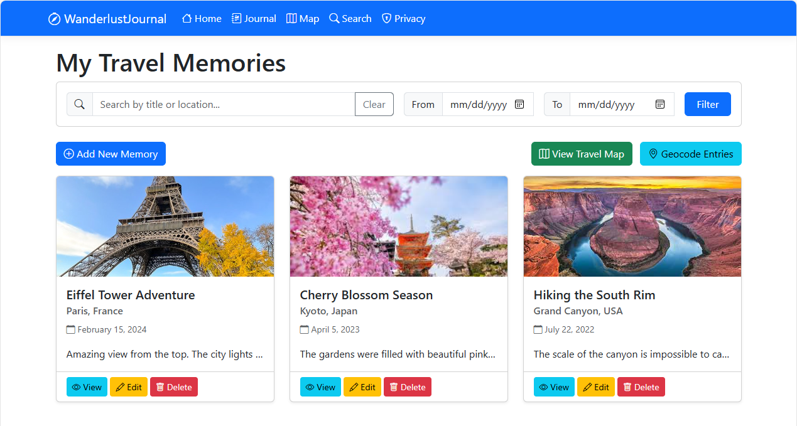

# .NET demo app with GitHub Copilot Agentic mode

This repo demonstrates how to use GitHub Copilot in Agentic mode to build a .NET application (in a [Vibe Coding](https://en.wikipedia.org/wiki/Vibe_coding) fashion). The app that we will be building step by step is a .NET Razor Web App that simulates a travel journal. We will call this application *Wanderlust Journal*.

Here is a screenshot of the homepage of the final application:



To run each app inside a given step, simply enter the corresponding folder and enter `dotnet run`.

## Steps

We will use only GitHub Copilot in Agentic mode to create it. We will start from scratch and use always the `Claude 3.7 Sonnet (Preview)` model.
You will find all the versions of the application linked in each step. The application will progressively gather more functionalities at each step.

For each step, to replicate you shall copy the previous folder contents inside a new, empty folder that you create and work in that folder with GitHub Copilot Agent.

**NOTE:** we are working with LLMs here, so your actual output may and probably will be different than mine, and you might experience issues I did not experience, or the opposite. That's the beauty of it.

### Step 1: the basic app

Prompt to use:

```markdown
Create a new ASP.NET Core Razor Pages web application in C# called "Wanderlust Journal."

The app should allow users to manage a personal collection of travel memories.
Each memory (a "Journal Entry") should have the following fields:
- Id (int)
- Location (string)
- Title (string)
- DateVisited (DateTime)
- Notes (string, multiline)

Features:

- Home page with a welcome message and a link to view all journal entries
- List page (/Journal) to show all saved entries
- Details page for each entry
- Create, Edit, and Delete pages for CRUD operations
- Use in-memory data storage (like a static list or singleton service)
- Simple, scenic visual style (soft background image, travel-themed colors) using Bootstrap or Tailwind

Keep the code clean and ready for future extensions.
```

Resulting code is in the [WanderlustJournal.1](./WanderlustJournal.1/) folder.

### Step 2: add search and filtering in the homepage

Prompt to use:

```markdown
Add a search bar to the Journal list page to filter entries by location or title.
Make the filtering case-insensitive and update results in real-time as the user types (with JavaScript or partial page reload).
Optionally, add a date range filter (start date, end date) to narrow down the entries by DateVisited.
```

Resulting code is in the [WanderlustJournal.2](./WanderlustJournal.2/) folder.

### Step 3: add upload functionality

Prompt to use:

```markdown
Add support for uploading a photo with each journal entry in the Wanderlust Journal web app.
Allow users to upload one image per entry (e.g., a travel photo).
Save the images to a local folder (wwwroot/uploads) and store the filename in the database.
Display the image on the detail and list pages.
Validate that only image files are allowed and limit the file size to 2MB.
```

**NOTE:** I was able to have the first upload working, but upon editing an existing entry it was not possible to edit it. So I tried with `uploading an image works, but if I edit an entry it does not update the image with the new one` and it got fixed. I then found strange behaviours when editing vs. creating new, and I chatted a bit to have that fixed, simply by explaining what I was observing.

Resulting code is in the [WanderlustJournal.3](./WanderlustJournal.3/) folder.

### Step 4: add persistent storage

Prompt to use:

```markdown
Extend the Wanderlust Journal web app to use SQLite for persistent storage.
Replace the in-memory list with an EF Core DbContext and a SQLite database.
Create a JournalContext class and configure it in Startup.cs or Program.cs.
Migrate the schema and seed the database with a few sample entries.
```

Resulting code is in the [WanderlustJournal.4](./WanderlustJournal.4/) folder.

### Step 5: add map integration

Prompt to use:

```markdown
Add a map view to display the visited locations in the Wanderlust Journal app.
Use [Leaflet API](https://leafletjs.com/reference.html) to plot markers based on the Location field of each journal entry.
Allow clicking on a marker to show the journal title and link to the detail page.
Use [Nominatim API](https://nominatim.org/) for geocoding, to convert place names into coordinates.
```

Resulting code is in the [WanderlustJournal.5](./WanderlustJournal.5/) folder.

**NOTE:** here I encountered some errors at runtime, and I basically copied and pasted the exceptions in GitHub Copilot to have it fix them for me.

## PRD (Product Requirements Document) and copilot-instructions.md

The repo also provides a [PRD](./prd.md) that outlines the high-level requirements for the Wanderlust Journal app. Additionally, there is a [copilot-instructions.md](./github/copilot-instructions.md) file that contains instructions for using GitHub Copilot in Agentic mode to guide it towards completion.

Specifying the usage of the PRD is highly suggested, and you can use an approach like the following:

> start implementing into #folder:WanderlustJournal.1 the PRD in #file:prd.md. At each step, mark the corresponding tick into the file, to keep track of the progress status.
